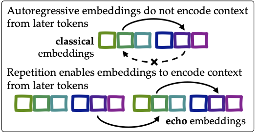

# [Repetition Improves Language Model Embeddings](https://arxiv.org/abs/2402.15449)

We present _echo embeddings_, an embedding strategy designed to address an architectural limitation of autoregressive models: that token embeddings cannot contain information from tokens that appear later in the input. Echo embeddings resolve this issue by repeating the input twice in the input to the embedding model. Our method has strong performance on MTEB and is compatible with many other methods for improving embedding models.




## Updates

- \[April 17, 2024\]: We have released our dataset for download [here](https://drive.google.com/file/d/1YqgaJIzmBIH37XBxpRPCVzV_CLh6aOI4/view) (3.64 GB).
- We will be releasing full training code soon.


## A quick demo
To download our pretrained model on Hugging Face and generate embeddings, run the following. Ensure that Hugging Face `transformers` library is installed.
```bash
git clone https://github.com/jakespringer/echo-embeddings.git
cd echo-embeddings
python example.py
```

## Usage
To use the embeddings, we first need some imports,
```python
from echo_embeddings import EchoEmbeddingsMistral, EchoPooling, EchoParser
```

Then, we will specify the templates that we will use to embed,
```python
templates = {
    'query': '<s>Instruct:{!%%prompt%%,}\nQuery:{!%%text%%}\nQuery again:{%%text%%}{</s>}',
    'document': '<s>Document:{!%%text%%}\nDocument again:{%%text%%}{</s>}',
}
```

Tips:
- Always include a beginning of sentence tag `<s>` (it isn't added for you!)
- The parser will replace variables and compute embeddings on things inside of braces, 
  so be sure to reference variables inside of braces only (e.g. `{!%%prompt%%,}` will be 
  replaced with the prompt followed by a comma, and `{%%text%%}` will be replaced with the text)
- The pooling will take the {mean, last} of the token embeddings that are inside braces
  except when the braces start with `{! which means the text won't be included}`. See usage
  in the example below.
- Example: `<s>The last-token of {this text %%text%% will be </s>} even though there
            is {!text after it.</s>}`
- When using `max_tokens`, the parser will enforce that every separate `{}` has at most 
  `max_tokens`; this means that if you have multiple braces, the `max_tokens` will be
  enforced for each set of braces separately. This is why `{</s>}` is enclosed in 
  separate braces: so that `</s>` will not be cut off if `%%text%%` exceeds the `max_tokens`.

Then, create and load the model, parser, and pooling strategy,
```python
# Create the model
path_to_model = 'jspringer/echo-mistral-7b-instruct-lasttoken'
model = EchoEmbeddingsMistral.from_pretrained(path_to_model)
model = model.eval()

# Create the parser
parser = EchoParser(path_to_model, templates, max_length=300)

# Create the pooling: strategy can either be mean or last
pooling = EchoPooling(strategy='last')
```

Be sure to use the `jspringer/echo-mistral-7b-instruct-meantoken` checkpoint if you would like to use mean token pooling.

Specify the prompt, query, and document. The first element in the tuple of the query and document tells the parser that you want to use the `query` or `document` template that we specified above. You can replace it with any template label specified in the templates dictionary.
```python
prompt = 'Retrieve passages that answer the question'
query = ('query', 'What is the capital of France?')
document = ('document', 'Paris is the capital of France.')
```

If you want to compute the symmetric similarity (i.e., sentence similarity), encode both sentences using the query template.

Now, we can query the model to extract embeddings by first parsing the query, then running the model, and then pooling,
```python
with torch.no_grad():
    # Query
    query_parsed_and_tokenized = parser(query)
    query_token_embedding = model(query_parsed_and_tokenized)
    query_embedding = pooling(query_token_embedding)['sentence_embedding']

    # Document
    document_parsed_and_tokenized = parser(document)
    document_token_embedding = model(document_parsed_and_tokenized)
    document_embedding = pooling(document_token_embedding)['sentence_embedding']
```

Finally, we can compute cosine similarity!
```python
cosine_sim = torch.dot(query_embedding, document_embedding) / (torch.norm(query_embedding) * torch.norm(document_embedding))
# 0.5797
```

Take a look at [example.py](example.py) for a more complete example.


## Training

We will be releasing training code soon. For now, if you wish to replicate or build on our work, you can download our dataset from [this Google Drive link](https://drive.google.com/file/d/1YqgaJIzmBIH37XBxpRPCVzV_CLh6aOI4/view) (3.64 GB). The dataset is a collection of approximately 1.5M training examples and mined hard negatives from the following datasets:
- ELI5 (sample ratio 0.1)
- HotpotQA
- FEVER 
- MIRACL
- MS-MARCO passage ranking (sample ratio 0.5)
- MS-MARCO document ranking (sample ratio 0.2)
- NQ
- SNLI + MNLI
- SQuAD
- TriviaQA
- Quora Duplicate Questions (sample ratio 0.1)
- Mr. TyDi
- DuReader
- T2Ranking (sample ratio 0.5)

Please refer to our paper for additional details and citations.


## Citation

If you find our paper, code, or models useful, please consider citing [Repetition Improves Language Model Embeddings](https://arxiv.org/abs/2402.15449).

```
@article{springer2024repetition,
  title={Repetition Improves Language Model Embeddings},
  author={Springer, Jacob Mitchell and Kotha, Suhas and Fried, Daniel and Neubig, Graham and Raghunathan, Aditi},
  journal={arXiv preprint arXiv:2402.15449},
  year={2024}
}
```
